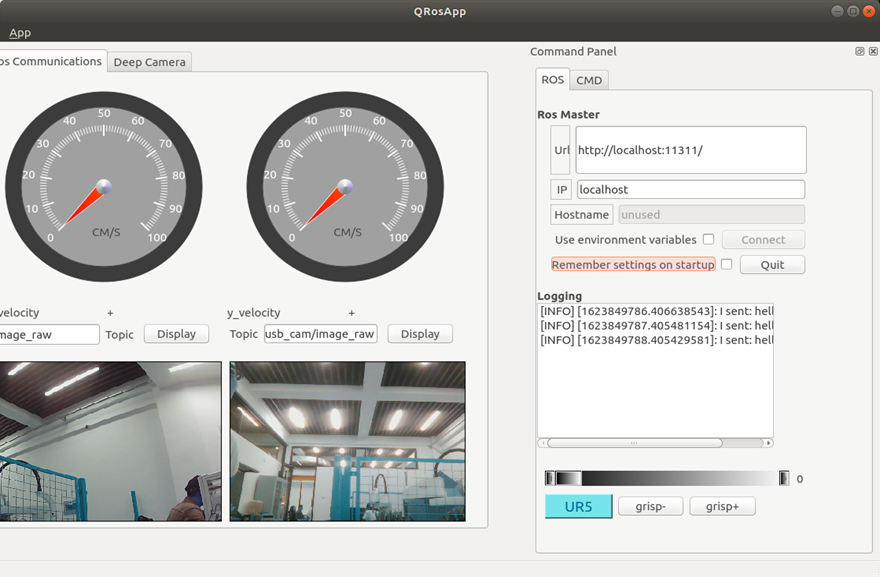
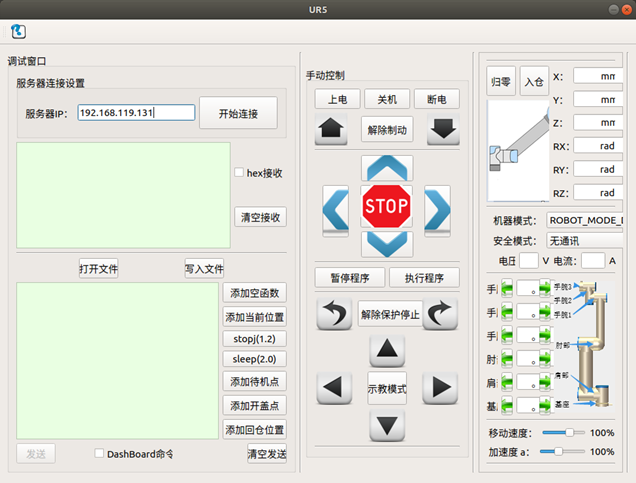
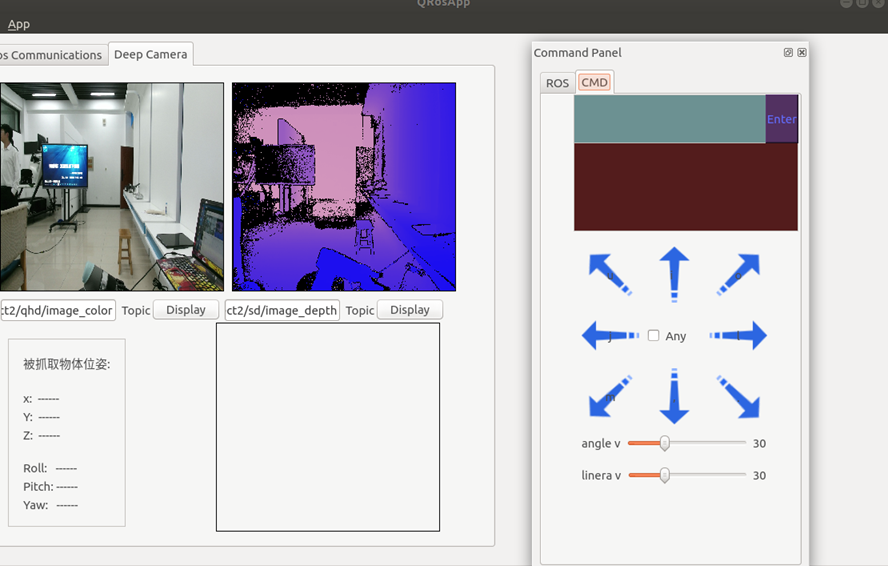
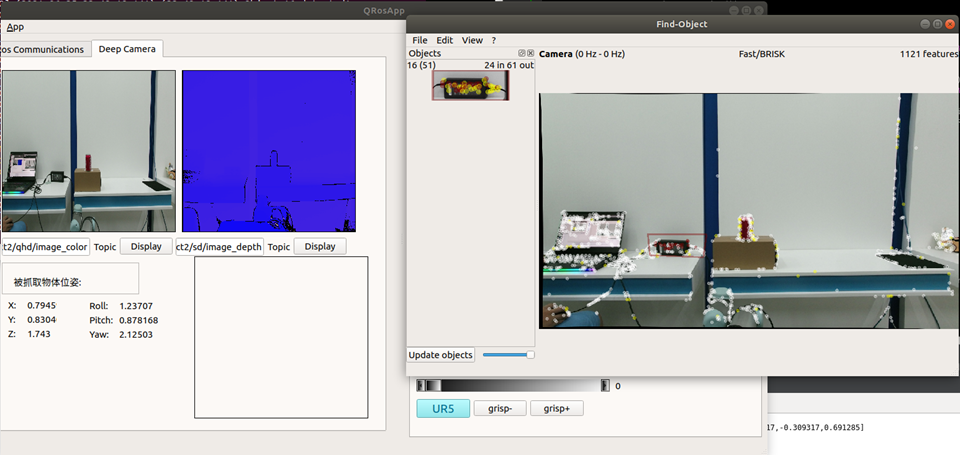
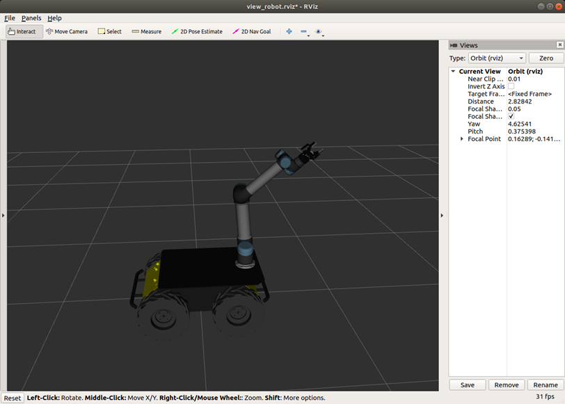
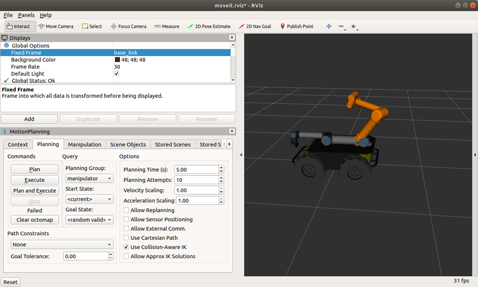
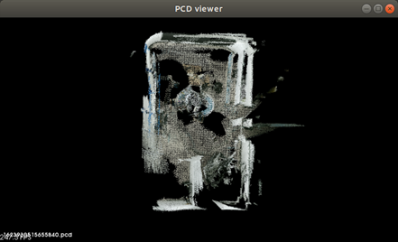
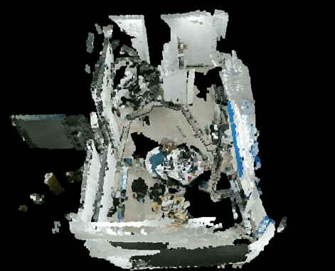

# 基于Ros-qt移动抓取平台

# 效果图

车辆仪表盘，相机话题消息显示，夹爪控制界面




UR5控制界面




Kinect 3d识别,键盘控制husky,命令行输入






仿真moveit







建图RTAB







# UR5

## 機械爪

啓動

```bash
 sudo bash
 rosrun robotiq_2f_gripper_control Robotiq2FGripperRtuNode.py /dev/ttyUSB0

 rosrun robotiq_2f_gripper_control Robotiq2FGripperSimpleController.py

```

a激活 燈變藍

# QT上位机开发

## 环境搭建

### melodic版本

*   安装qt

apt : sudo apt-get install qtcreator

安装包: [http://download.qt.io/archive/qt/5.9/5.9.9/qt-opensource-linux-x64-5.9.9.run](http://download.qt.io/archive/qt/5.9/5.9.9/qt-opensource-linux-x64-5.9.9.run "http://download.qt.io/archive/qt/5.9/5.9.9/qt-opensource-linux-x64-5.9.9.run")

```纯文本
wget http://download.qt.io/archive/qt/5.9/5.9.9/qt-opensource-linux-x64-5.9.9.run
chmod a+x qt-opensource-linux-x64-5.9.9.run
./qt-opensource-linux-x64-5.9.9.run
```

*   添加qtcreator到环境变量

`sudo gedit /usr/bin/qtcreator`

内容

```bash
#!/bin/sh 
export QT_HOME=/home/xxxx/Qtxxx/Tools/QtCreator/bin 
$QT_HOME/qtcreator $*
```

```纯文本
sudo chmod a+x /usr/bin/qtcreator
```

terminal 输入 qtcreater

*   安装依赖:

sudo apt-get install ros-melodic-qt-create

sudo apt-get install ros-melodic-qt-build

*   完成之后就可以通过catkin\_create\_qt\_pkg来创建ros gui包

mkdir -p catkin\_qt/src

cd catkin\_qt/src/

catkin\_create\_qt\_pkg class1\_ros\_qt\_demo roscpp rviz

编译:catkin\_make

打开项目:

*   文件->打开项目->选择工作空间下的cmakelist.txt（注意并非功能包下的）

*   将build的构建目录改为当前工作空间的build文件夹

可能会发现版本不匹配的错误,如果没有就跳过

将功能包的cmakelist.txt进行更改:

*   更改为如下，注意将class1\_ros\_qt\_demo 更改为自己的功能包名, 如我的class1\_ros\_qt\_demo

```cmake
##############################################################################
# CMake
##############################################################################

cmake_minimum_required(VERSION 2.8.0)
project(class1_ros_qt_demo)
set(CMAKE_INCLUDE_CURRENT_DIR ON)

##############################################################################
# Catkin
##############################################################################

# qt_build provides the qt cmake glue, roscpp the comms for a default talker
find_package(catkin REQUIRED COMPONENTS rviz roscpp)

find_package(Qt5 REQUIRED Core Widgets)
set(QT_LIBRARIES Qt5::Widgets)
include_directories(${catkin_INCLUDE_DIRS})
# Use this to define what the package will export (e.g. libs, headers).
# Since the default here is to produce only a binary, we don't worry about
# exporting anything. 
catkin_package()

##############################################################################
# Qt Environment
##############################################################################

# this comes from qt_build's qt-ros.cmake which is automatically 
# included via the dependency call in package.xml
#rosbuild_prepare_qt4(QtCore QtGui) # Add the appropriate components to the component list here

##############################################################################
# Sections
##############################################################################

file(GLOB QT_FORMS RELATIVE ${CMAKE_CURRENT_SOURCE_DIR} ui/*.ui)
file(GLOB QT_RESOURCES RELATIVE ${CMAKE_CURRENT_SOURCE_DIR} resources/*.qrc)
file(GLOB_RECURSE QT_MOC RELATIVE ${CMAKE_CURRENT_SOURCE_DIR} FOLLOW_SYMLINKS include/class1_ros_qt_demo/*.hpp *.h)

QT5_ADD_RESOURCES(QT_RESOURCES_CPP ${QT_RESOURCES})
QT5_WRAP_UI(QT_FORMS_HPP ${QT_FORMS})
QT5_WRAP_CPP(QT_MOC_HPP ${QT_MOC})

##############################################################################
# Sources
##############################################################################

file(GLOB_RECURSE QT_SOURCES RELATIVE ${CMAKE_CURRENT_SOURCE_DIR} FOLLOW_SYMLINKS src/*.cpp)

##############################################################################
# Binaries
##############################################################################

add_executable(class1_ros_qt_demo ${QT_SOURCES} ${QT_RESOURCES_CPP} ${QT_FORMS_HPP} ${QT_MOC_HPP})
target_link_libraries(class1_ros_qt_demo ${QT_LIBRARIES} ${catkin_LIBRARIES})
install(TARGETS class1_ros_qt_demo RUNTIME DESTINATION ${CATKIN_PACKAGE_BIN_DESTINATION})
```

*   package.xml

```xml
<?xml version="1.0"?>
<package>
  <name>class1_ros_qt_demo</name>
  <version>0.1.0</version>
  <description>

     class1_ros_qt_demo

  </description>
  <maintainer email="chengyangkj@gmail.com">chengyangkj</maintainer>
  <author>chengyangkj</author>
  <license>BSD</license>
  <!-- <url type="bugtracker">https://github.com/stonier/qt_ros/issues</url> -->
  <!-- <url type="repository">https://github.com/stonier/qt_ros</url> -->
  <buildtool_depend>catkin</buildtool_depend>
  <!--build_depend>qt_build</build_depend-->
  <build_depend>roscpp</build_depend>
  <!--build_depend>libqt4-dev</build_depend-->
  <!--run_depend>qt_build</run_depend-->
  <run_depend>roscpp</run_depend>
  <!--run_depend>libqt4-dev</run_depend-->
  <build_depend>roscpp</build_depend>
  <run_depend>roscpp</run_depend>
  <build_depend>rospy</build_depend>
  <run_depend>rospy</run_depend>

<build_depend>rviz</build_depend>
  <run_depend>rviz</run_depend>
  <build_depend>qtbase5-dev</build_depend>
  <run_depend>libqt5-core</run_depend>
  <run_depend>libqt5-gui</run_depend>
  <run_depend>libqt5-widgets</run_depend>
</package>
```

保存再次执行cmake, 即可成功


*   更改功能包main\_window\.hpp

*   由于Q4t中包含QMainWindow在QtGui中，在Qt5中更改为QtWidgets类中，所以需要作更改：

*   ./include/功能包名/main\_window\.hpp

*   修改如下：

```纯文本
#include <QtGui/QMainWindow>
变更为：
#include <QtWidgets/QMainWindow>
```

*   点击左下角的三角标识符，进行编译运行

*

## 圖像顯示問題

\[ WARN] \[1621071748.717816346]: \[image\_transport] It looks like you are trying to subscribe directly to a transport-specific image topic '/usb\_cam/image\_raw/compressed',&#x20;

in which case you will likely get a connection error. Try subscribing to the base topic '/usb\_cam/image\_raw' instead with parameter \~image\_transport set to 'compressed' (on the command line, \_image\_transport:=compressed).&#x20;

See [http://ros.org/wiki/image\_transport](http://ros.org/wiki/image_transport "http://ros.org/wiki/image_transport")for details.似乎您正在尝试直接订阅特定于传输的图像主题“ /usb\_cam /image\_raw /compressed”，在这种情况下，您可能会遇到连接错误。尝试订阅基本主题“ /usb\_cam /image\_raw”，而将参数〜image\_transport设置为“ compressed”（在命令行上，\_ image\_transport：= compressed）
解決問題了：
需要開啓多線程

```c++
void QNode::run() {
    ros::AsyncSpinner s(4);//第一種方法
     //ros::MultiThreadedSpinner s(2);//multi thread 第二種
    s.start();
  ros::Rate loop_rate(1);
  int count = 0;
  while ( ros::ok() ) {

    std_msgs::String msg;
    std::stringstream ss;
        ss << "hello world " << count;
        msg.data = ss.str();
        if(count<3)
        {
            chatter_publisher.publish(msg);
            log(Info,std::string("I sent: ")+msg.data);
        }
       
    ros::spinOnce();
    loop_rate.sleep();
    ++count;
  }
  std::cout << "Ros shutdown, proceeding to close the gui." << std::endl;
  Q_EMIT rosShutdown(); // used to signal the gui for a shutdown (useful to roslaunch)
}
```

# UR5使用

## 安裝

[參考](https://blog.csdn.net/zxxxiazai/article/details/103568577 "參考")
沒有ur\_msgs依賴，需要下載
[https://github.com/ros-industrial/ur\_msgs.git](https://github.com/ros-industrial/ur_msgs.git "https://github.com/ros-industrial/ur_msgs.git")
放到驅動功能包裏面

## Gazebo simulation

要在Gazebo中调出模拟机器人，请运行：

roslaunch ur\_gazebo ur5.launch

MoveIt！使用模拟机器人
再次，您可以使用MoveIt！控制模拟机器人。

用于设置MoveIt！节点允许运动计划运行：

roslaunch ur5\_moveit\_config ur5\_moveit\_planning\_execution.launch sim:=true

使用包含MoveIt的配置启动RViz！运动规划插件运行：

roslaunch ur5\_moveit\_config moveit\_rviz.launch config:=true

**注意：**
作为MoveIt！似乎很难找到具有完全关节限制的UR的计划\[-2pi，2pi]，有一个使用限制为\[-pi，pi]的关节限制的joint\_limited版本。要使用此联合限制版本，只需使用启动文件参数’limited’，即：

roslaunch ur\_gazebo ur5.launch limited:=true

roslaunch ur5\_moveit\_config ur5\_moveit\_planning\_execution.launch sim:=true limited:=true

roslaunch ur5\_moveit\_config moveit\_rviz.launch config:=true

如果無法加載模型

```纯文本
roscore
rosrun gazebo_ros gazebo 
```

## ur+gripper

查看模型

```纯文本
roslaunch ur_description view_ur5.launch
roslaunch ur_description view_ur5_with_gripper.launch
```

运行UR5的Gazebo仿真和moveit+rviz规划

```纯文本
roslaunch ur_gazebo ur5.launch
roslaunch ur_planning ur_sc_planning.launch
```

运行带有robotiq85夹爪的仿真规划

```纯文本
roslaunch ur_gazebo ur5_with_gripper.launch
roslaunch ur_planning ur_with_gripper_sc_planning.launch
```

## husky+ ur+gripper

```bash
roslaunch husky_ur_description gazebo_huskyWithUR5.launch

roslaunch husky_ur_bringup ur5_moveit_planning_execution.launch sim:=true

roslaunch husky_ur_bringup moveit_rviz.launch config:=true
```


下面是参考github的[项目](https://github.com/husky/husky_manipulation.git "项目")，可以根据作者的项目进行搭建，源码这部分没有提供。

# husky\_manipulation

该软件包的目的是使操纵器的集成更加简单

## 克隆

git clone [https://github.com/husky/husky\_manipulation.git](https://github.com/husky/husky_manipulation.git "https://github.com/husky/husky_manipulation.git") --recursive

## URDF

在您的URDF中，确保包含所需的husky\_manipulation description。例如，如果您使用单个UR5，请确保在URDF中包括以下行：

```xml
<xacro:include filename="$(find husky_ur_description)/urdf/husky_ur5_description.urdf.xacro" />
```

然后，您将需要将URDF导出为机器人的URDF\_EXTRA。这会将它“附加”到husky。方便将所有这些添加到单个Shell脚本文件中，以后可以获取该脚本文件。确保来源初始脚本，因为这将确保设置任何其他必要的环境变量

```bash
source $(catkin_find husky_ur_description)/scripts/husky_ur5_envar.sh
export HUSKY_URDF_EXTRAS=$(catkin_find your_description_package urdf/your_description.urdf.xacro --first-only)

```

## 手臂定位

上面的内容应该使您的husky附有一只或多只手臂。它们将被附加在默认位置。如果需要更改机械臂的安装位置，请在下面导出必要的变量。

```纯文本
HUSKY_LEFT_UR_XYZ
HUSKY_LEFT_UR_RPY
HUSKY_RIGHT_UR_XYZ
HUSKY_RIGHT_UR_RPY
```

实例
export HUSKY\_LEFT\_UR\_XYZ="-0.3 0.0 0.2"

## 更新Moveit配置

### 安装程序包

husky\_manipulation软件包已经具有moveit配置设置。该配置对于机器人来说应该是简单易用的的，但是您可能会收到奇怪的碰撞或关于缺少关节的警告。如果您的机器人是自定义的，则可以使用该moveit配置作为您的机器人的起点。

进入工作区中的src文件夹，然后运行以下命令：
`rosrun husky_ur_moveit_config customize_moveit.sh <new_package_name>`
该命令将在src文件夹中创建一个新的moveit程序包，该程序包应已准备好针对实际平台进行自定义

### 定制包

如果使用custom\_husky设置方法（indigo），则在运行设置助手时必须临时更改URDF。从URDF中删除以下指示的两行。一旦设置了MoveIt配置，即可将其重新添加

```纯文本
<xacro:include filename="$(find husky_description)/urdf/husky.urdf.xacro" />
<xacro:husky_robot />
```

要自定义moveit配置，请运行以下命令：
roslaunch \<new\_package\_name> setup\_assistant.launch

该命令将打开此窗口


点击 Load File 这会将urdf加载到配置器中。密切注意终端。如果您的配置与默认配置有很大不同，您可能会看到一些警告，但是如果看到很多警告，则可能是某些来源不正确。取消此操作，并确保所有内容均正确来源，然后再次运行。在右侧的3D视图窗口中签入，并确保这是您的机器人的外观。我最近看到3D窗口为空的问题。不确定如何解决此问题。


如果你不需要深度自定义的话，那么可能只需要更改3个标签即可：


*   self-collisions


    

在此下方，将滑块一直拖动到最右边，然后单击“重新生成默认碰撞矩阵”。根据模型的复杂程度，这可能需要一分钟的时间。完成后，快速浏览一下已自动禁用的冲突。请特别注意由于“默认冲突”而被禁用的冲突。这意味着当关节为零时，它会撞到某些东西。取消选中您希望查看是否发生的任何碰撞

*   Robot pose


这些已保存的命名位置可以稍后调用。如果要添加任何预定义的姿势或修改已经存在的存放位置，则可以单击“添加姿势”或“编辑所选内容”并拖动滑块以设置新位置


*   Passive Joints
    固定关节是MoveIt无需担心的关节。这些就是车轮接头或PTU。在此菜单下，选择不是手臂关节的任何东西，并确保它在正确的列表中

!]\([https://images.gitee.com/uploads/images/2020/1211/142906\_92817039\_8042238.png](https://images.gitee.com/uploads/images/2020/1211/142906_92817039_8042238.png "https://images.gitee.com/uploads/images/2020/1211/142906_92817039_8042238.png") "屏幕截图.png")

## 保存

或许会遇到警报，但没事


下一步将向您显示向导负责的文件列表。确保除了以下内容外，什么都没有选择：

```纯文本
Config/
Launch/
config/Husky.srdf
```

如果您修改的内容超出了以上概述的部分，则可能需要编辑其他文件，但这可能会带来其他后果。


选择这些文件后，单击“生成程序包”，然后关闭向导

## 开始运行吧

在实际的机器人上有2个部分需要运行

### 驱动

假设机器人全部启动并且手臂已设置好，那么您应该能够运行

```纯文本
roslaunch husky_ur_bringup husky_ur_bringup.launch
```

如果工作正常，则应该在RVIZ中看到手臂的正确放置，或者应该在/ joint\_states主题上看到UR关节的发布。

## Moveit

MoveIt！是手臂的计划和执行界面。它与驱动程序分开运行。运行MoveIt！，也就是您在上面创建的配置

`roslaunch dummy_moveit_config husky_ur_moveit_planning_execution.launch`
您应该不会在终端中看到任何错误。现在，您应该能够在RVIZ中添加Moveit MotionPlanning插件并控制机械臂了！
